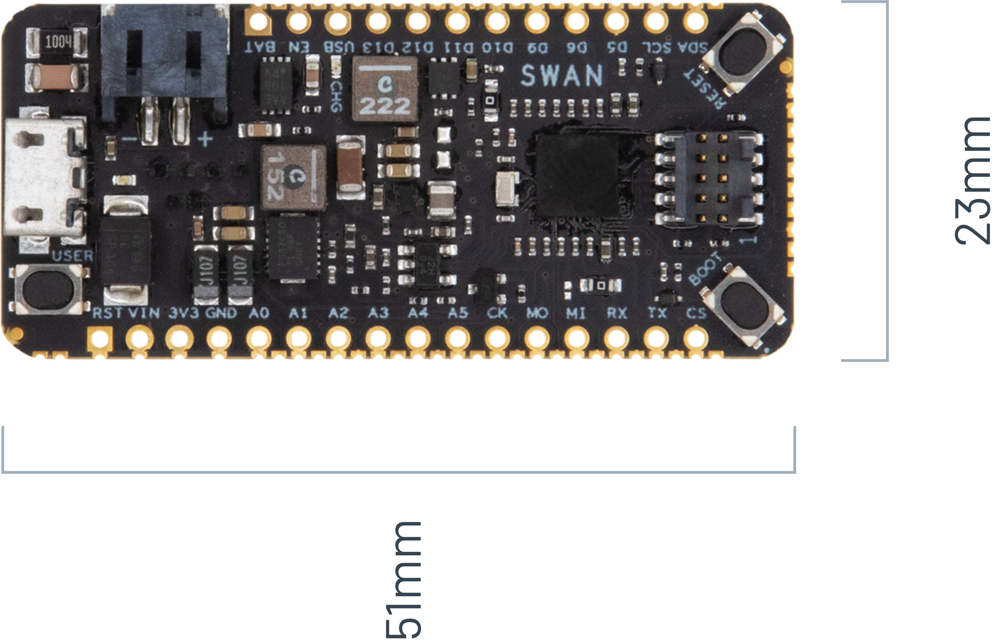

# Rust on STM32L4R5 (or the Blues.io Swan) Quick Demo

This repository contains everything needed to flash an LED on an STM32L4R5. And
is tested on the [Blues Wireless Swan](https://blues.io/products/swan/).

<p align="center">
  
</p>

It shows how to set up a project to build for the Cortex-M4 core.

This demo uses an STM32L4R5 specifically, but should be easy to port to another
STM32L4. See the Porting section below for information.

## Trying It Out

First make sure your Rust is set up.
[Install rustup](http://rustup.rs/) if you haven't already, and install
the latest stable Rust. Then ensure you have added the required thumbv7 target:
```
$ rustup target add thumbv7em-none-eabihf
```
Now you can download this repository and build it:
```
$ git clone https://github.com/gauteh/swan-stm32l4r5-quickstart
$ cd swan-stm32l4r5-quickstart
$ cargo build --release
```

The ELF binary file is in `target/thumbv7em-none-eabihf/release/swan-stm32l4r5-quickstart`.
For information on how to program it on your target, consult the
[embedded Rust docs](https://rust-embedded.github.io/bookshelf/).

If you have a debug probe, like the [STLINK-V3MINI](https://www.st.com/en/development-tools/stlink-v3mini.html), you can run the project with:

```
$ cargo run
```

## Porting to another STM32L4

See the instructions for the [STM32F4 demo](https://github.com/adamgreig/stm32f4-demo#porting-to-another-stm32f4).

## License

MIT license ([LICENSE-MIT](LICENSE-MIT) or http://opensource.org/licenses/MIT)

## Credits

Repository modeled after: https://github.com/adamgreig/stm32f4-demo
